<p align="center">
  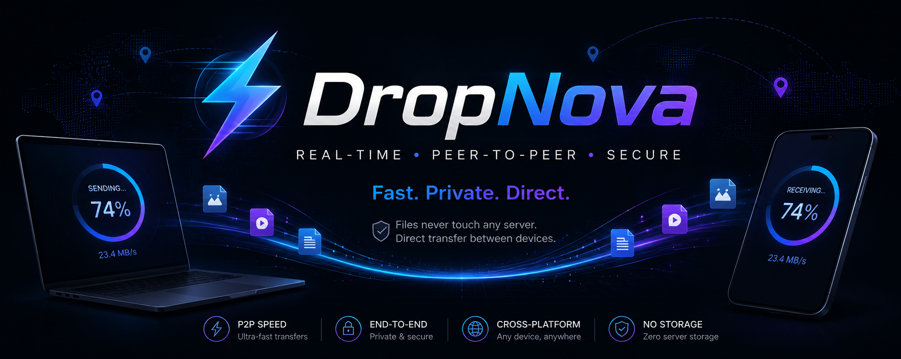
</p>

<h1 align="center">⚡ DropNova</h1>

<p align="center">
  <b>Real-Time Peer-to-Peer File Transfer using WebRTC</b>
</p>

<p align="center">
Transfer files directly between devices without uploading them to a cloud server.
</p>

<p align="center">


</p>

<p align="center">
<a href="https://dropnovaa.netlify.app">🌐 Live Demo</a>
</p>

---

# 📖 Table of Contents

- About DropNova
- Why I Built This
- Features
- Screenshots
- System Architecture
- WebRTC Connection Flow
- File Transfer Flow

---

# 🚀 About DropNova

DropNova is a browser-based peer-to-peer file sharing application that allows users to securely transfer files directly between two devices using **WebRTC DataChannels**.

Unlike traditional file sharing services, files are **never uploaded to the server**. The backend is used **only for signaling**, while the actual file travels directly from one browser to another.

This provides:

- Faster transfers
- Better privacy
- Lower server bandwidth
- Zero cloud storage
- Cross-platform compatibility

The application works directly inside the browser without requiring software installation.

---

# 💡 Why I Built DropNova

The idea came from a real-world problem.

During a hackathon, I frequently needed to share files with teammates and mentors using different laptops.

The common options were surprisingly inconvenient:

- Connect my phone through a USB cable
- Upload files to Google Drive
- Send files through WhatsApp
- Share my personal phone number
- Install a common file-sharing application on both devices

None of these felt quick or practical, especially when sharing files with someone I had just met.

I wanted something much simpler.

Open a website.

Generate a pairing code.

Connect two devices.

Transfer the files.

Done.

No login.

No registration.

No account.

No cloud upload.

No phone number.

No installation.

That idea became **DropNova**.

---

# ✨ Features

- ⚡ Direct Peer-to-Peer file transfer using WebRTC
- 🔐 Secure browser-to-browser communication
- 🌐 FastAPI WebSocket signaling server
- 📱 QR Code based device pairing
- 🔢 6-digit pairing code
- 📂 Multiple file transfer support
- 📊 Live transfer progress
- 🚫 Transfer cancellation
- 🔄 Resume support for interrupted transfers
- 💾 Native File System Access API support
- 📁 OPFS fallback for browsers without File System Access API
- 📱 Mobile browser compatibility
- 🌙 Dark theme UI
- 🌍 Cross-network support using STUN
- ⚡ Same-network optimized transfers
- 🧹 Automatic memory cleanup
- 🗑 Automatic session cleanup
- 🔌 Automatic disconnect handling
- 👥 One sender and one receiver per session
- 📦 Chunk-based file transfer
- 🚀 Browser-based application (no installation required)
- 🔒 Files never pass through the backend server

---

# 📸 Screenshots

## 🏠 Home

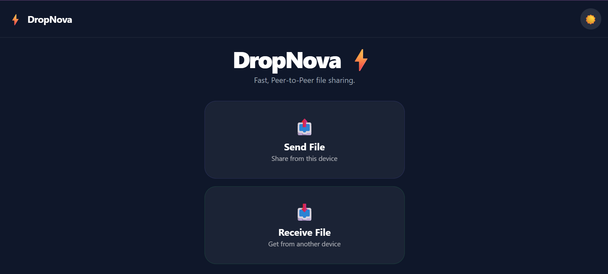

---

## 📤 Sender Pairing

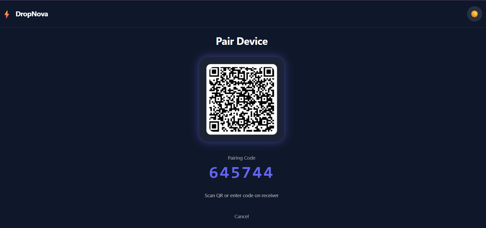

---

## 📥 Receiver Pairing

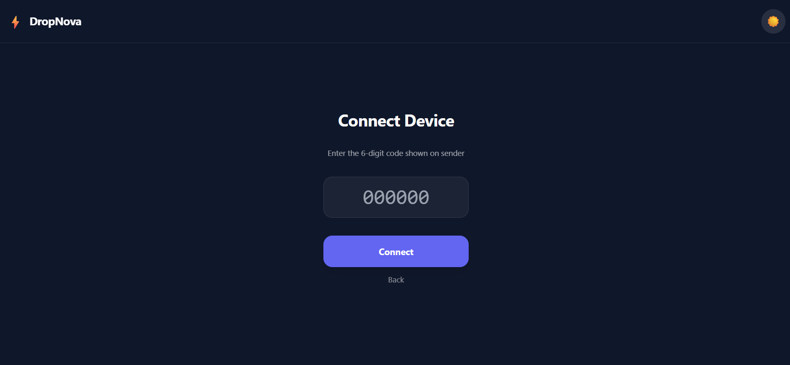

---

## 🔗 Devices Connected

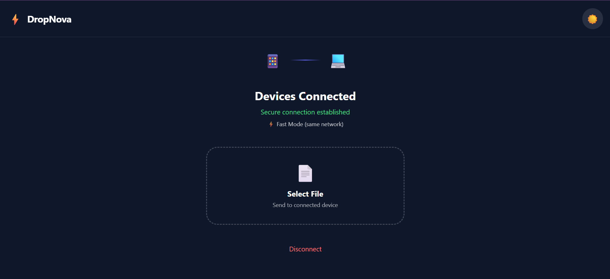

---

## 📤 Sending Files

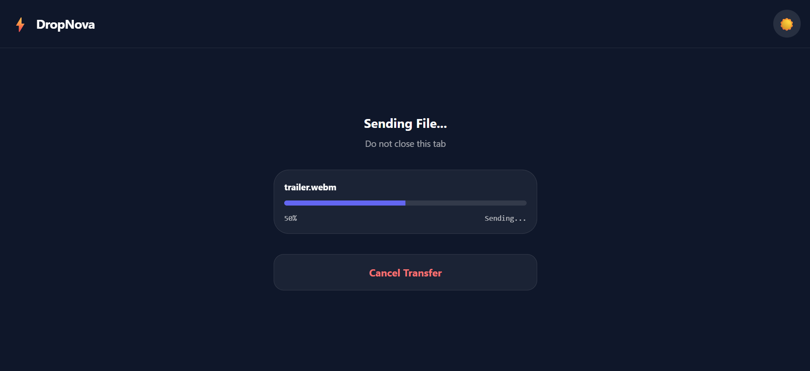

---

## 📥 Receiving Files

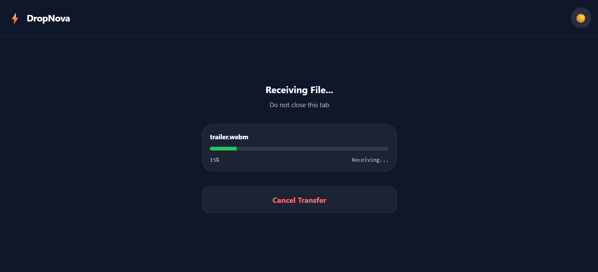

---

## ✅ Transfer Complete

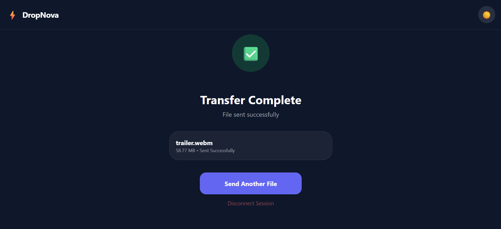

---

## 💡 Light Theme


---

## 📱 Mobile Interface

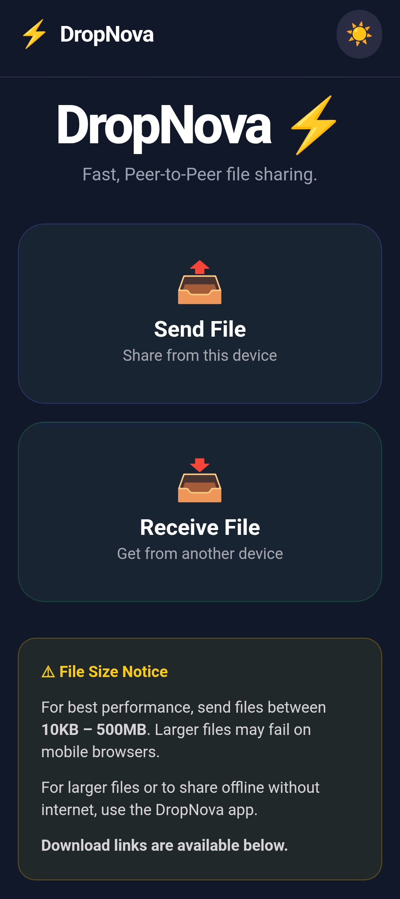

---

# 🏗 System Architecture

<p align="center">
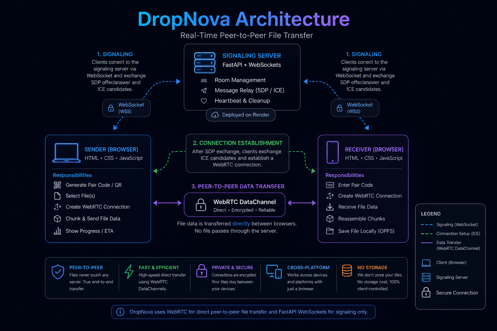
</p>

DropNova follows a hybrid architecture.

The backend only performs signaling between peers.

Once signaling is complete, both browsers establish a direct WebRTC DataChannel and communicate without routing file data through the server.

This significantly reduces backend bandwidth while increasing transfer speed and privacy.

---

# 🔄 WebRTC Connection Flow

<p align="center">
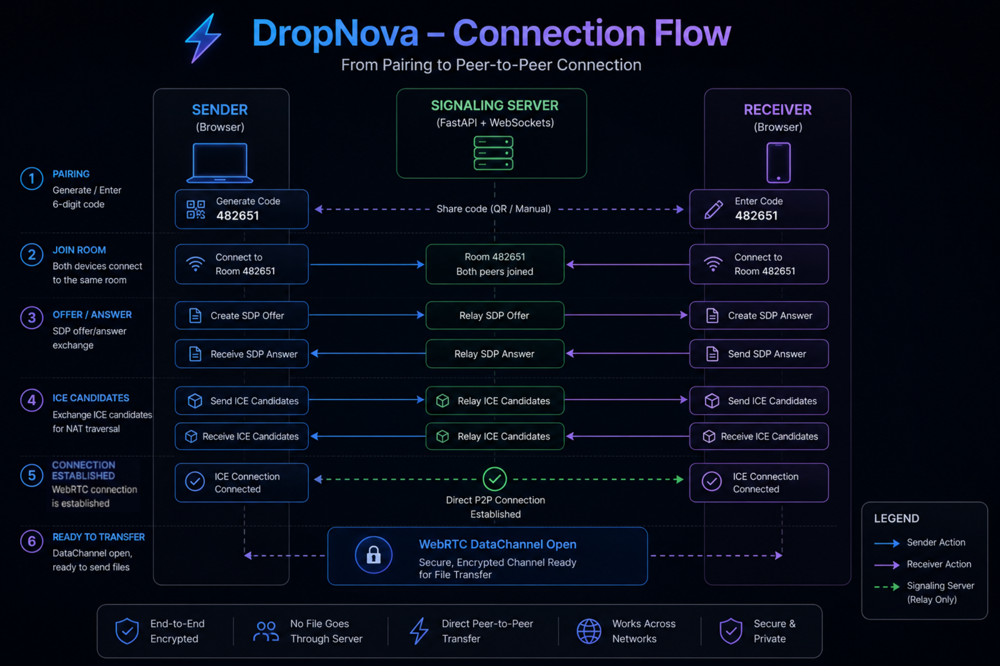
</p>

Connection Establishment:

1. Sender generates a 6-digit pairing code.
2. Receiver joins using the code or QR Code.
3. Both devices connect to the FastAPI signaling server.
4. SDP Offer and Answer are exchanged.
5. ICE Candidates are exchanged.
6. WebRTC DataChannel is established.
7. The signaling server is no longer involved in the file transfer.

---

# 📂 File Transfer Flow

<p align="center">
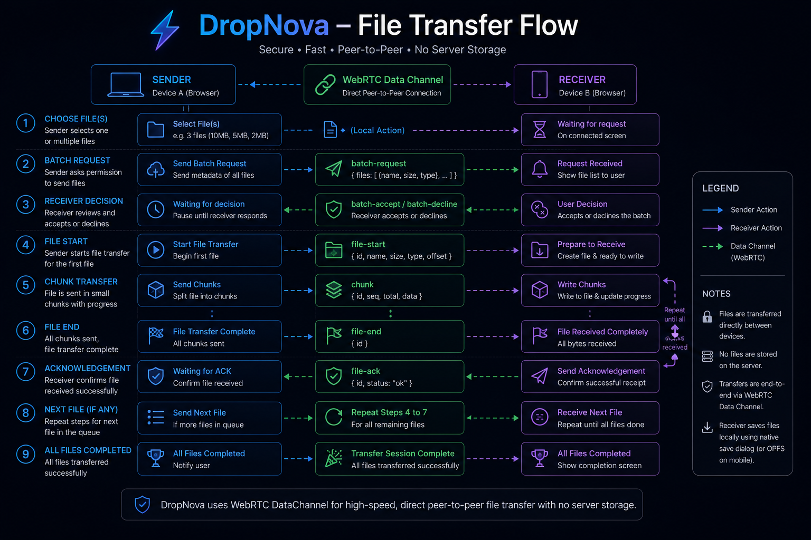
</p>

Each file transfer follows this sequence:

1. Sender selects one or more files.
2. Receiver receives a transfer request.
3. Receiver accepts the transfer.
4. Files are divided into chunks.
5. Chunks are streamed over the WebRTC DataChannel.
6. Progress is synchronized in real time.
7. Receiver acknowledges successful completion.
8. Both devices clean temporary resources automatically.

---

# ⚙️ Project Architecture

DropNova follows a lightweight hybrid architecture that separates the responsibilities of connection establishment and file transfer.

The backend is responsible only for signaling. It creates temporary communication rooms where two peers exchange the information required to establish a direct WebRTC connection.

Once the WebRTC DataChannel is established, the backend is no longer involved in the transfer process. Every file travels directly between the sender and receiver, reducing server bandwidth while improving speed and privacy.

The application consists of four major components:

- **Frontend (HTML, CSS & JavaScript)** — Handles the user interface, routing, QR code generation, progress tracking, and file management.
- **FastAPI Signaling Server** — Exchanges SDP Offers, Answers, and ICE Candidates through WebSockets.
- **WebRTC DataChannel** — Creates the secure peer-to-peer connection used to transfer file data.
- **Browser Storage APIs** — Uses the Native File System Access API where supported and OPFS as a fallback for compatible browsers.

---

# ⚡ How DropNova Works

## Step 1 — Open the Website

The sender opens DropNova and chooses **Send File**.

The receiver opens the same website and chooses **Receive File**.

---

## Step 2 — Pair the Devices

The sender generates:

- A unique 6-digit pairing code
- A QR Code containing the pairing information

The receiver can either:

- Enter the 6-digit code manually
- Scan the QR code

This creates a temporary signaling room.

---

## Step 3 — WebSocket Signaling

Both browsers establish a WebSocket connection with the FastAPI signaling server.

The server is responsible only for exchanging:

- SDP Offer
- SDP Answer
- ICE Candidates

No file data passes through the backend.

---

## Step 4 — WebRTC Connection

After signaling completes, both browsers establish a secure WebRTC DataChannel.

At this point:

- The connection becomes peer-to-peer.
- The signaling server is no longer involved.
- Files travel directly between both devices.

---

## Step 5 — File Selection

The sender selects one or multiple files.

DropNova supports:

- Single file transfer
- Multi-file transfer
- Different file types
- Batch transfers

---

## Step 6 — Transfer Request

Before any file is transferred, the receiver receives a confirmation prompt displaying:

- File names
- File sizes
- Number of files

The receiver can:

- Accept
- Decline

This prevents unwanted transfers.

---

## Step 7 — Chunk-Based Transfer

Instead of sending an entire file at once, DropNova divides every file into smaller chunks.

Chunk-based transfer provides several advantages:

- Lower browser memory usage
- Better transfer stability
- Accurate progress tracking
- Resume capability
- Improved handling of large files

Each chunk is streamed through the WebRTC DataChannel until the entire file has been transferred.

---

## Step 8 — Progress Tracking

During transfer, both devices display:

- Transfer percentage
- Live progress bar
- Current transfer status

The sender and receiver remain synchronized throughout the transfer.

---

## Step 9 — Transfer Completion

Once the final chunk is received:

- The receiver reconstructs the original file.
- The sender receives an acknowledgement.
- Temporary resources are cleaned automatically.
- Both users can immediately transfer another file without reconnecting.

---

# 🛠 Tech Stack

## Frontend

- HTML5
- CSS3
- Tailwind CSS
- JavaScript (ES6 Modules)

---

## Browser APIs

- WebRTC
- WebSocket
- File System Access API
- Origin Private File System (OPFS)
- QRCode.js

---

## Backend

- Python
- FastAPI
- WebSockets (Starlette)

---

## Deployment

- Netlify (Frontend)
- Render (Backend)

---

## Development Tools

- Git
- GitHub
- VS Code

---

# 📁 Project Structure

```text
DropNova
│
├── backend
│   ├── main.py
│   └── requirements.txt
│
├── frontend
│   ├── screens
│   │   ├── home.js
│   │   ├── send.js
│   │   ├── receive.js
│   │   ├── connected.js
│   │   ├── sending.js
│   │   ├── receiving.js
│   │   ├── completed.js
│   │   └── reconnect.js
│   │
│   ├── app.js
│   ├── router.js
│   ├── transfer.js
│   ├── fileTransfer.js
│   ├── webrtc.js
│   ├── style.css
│   └── index.html
│
├── screenshots
├── docs
├── README.md
├── LICENSE
└── .gitignore
```

---

# 🚀 Running Locally

## Clone the Repository

```bash
git clone https://github.com/mayanksingh05/dropnova.git
cd dropnova
```

---

## Backend

```bash
cd backend
pip install -r requirements.txt
uvicorn main:app --reload
```

The signaling server will start on:

```
http://localhost:8000
```

---

## Frontend

Open another terminal.

```bash
cd frontend
python -m http.server 5500
```

or

```bash
npx serve
```

Open:

```
http://localhost:5500
```

Update the WebSocket URL inside:

```
frontend/screens/send.js
frontend/screens/receive.js
```

Replace:

```javascript
wss://your-backend-url/ws/
```

with

```javascript
ws://localhost:8000/ws/
```

for local development.

---

# ☁️ Deployment

## Frontend

Deploy the frontend on **Netlify**.

---

## Backend

Deploy the FastAPI signaling server on **Render**.

---

After deployment, update the frontend WebSocket endpoint to point to your deployed backend.

---

# 🎯 Design Goals

While developing DropNova, the primary focus was to keep the user experience as simple as possible.

The application was designed with the following goals:

- No login required
- No account creation
- No phone number sharing
- No cloud uploads
- No software installation
- Fast device pairing
- Cross-platform compatibility
- Minimal user interaction
- Secure peer-to-peer communication

The objective was to make transferring files between laptops and phones as quick as scanning a QR code or entering a six-digit pairing code.

---

# 🔒 Security

Although DropNova is designed to be simple to use, privacy and security were important considerations throughout development.

### Peer-to-Peer Communication

Once a WebRTC connection is established, files are transferred directly between the sender and receiver.

The backend does **not** relay file data.

---

### No Server Storage

Files are never uploaded, stored, or cached on the backend server.

The FastAPI server is responsible only for exchanging signaling information required to establish the WebRTC connection.

---

### Temporary Sessions

Each transfer creates a temporary room for exactly two participants:

- One Sender
- One Receiver

After the transfer is complete or either user disconnects, the room is automatically cleaned up.

---

### User Confirmation

Before any transfer begins, the receiver must explicitly accept the incoming files.

This prevents unwanted or accidental file transfers.

---

### Automatic Cleanup

Temporary objects and browser resources are released after every transfer to reduce memory usage and avoid unnecessary storage consumption.

---

# ⚡ Performance

DropNova is designed to provide a fast and responsive file sharing experience.

Some performance-focused design decisions include:

- Direct browser-to-browser communication
- Chunk-based file transfer
- No backend file relay
- Minimal server bandwidth usage
- Low latency after connection establishment
- Multi-file transfer support
- Automatic resource cleanup
- Responsive interface for desktop and mobile browsers

Since file data does not pass through the backend, transfer speeds primarily depend on:

- Internet connection quality
- Device performance
- Browser capabilities
- WebRTC connection quality

---

# ⚠️ Known Limitations

Like any project, DropNova has some current limitations.

### Render Free Tier

The deployed backend uses Render's free tier.

If the backend has been idle, the first connection may take a few seconds while the service wakes up.

---

### No TURN Server

DropNova currently relies on STUN servers for NAT traversal.

In some restrictive corporate networks or strict NAT environments, establishing a direct peer-to-peer connection may not be possible.

Adding a TURN server would improve compatibility.

---

### Browser Support

Some browser APIs used by DropNova are not supported equally across all browsers.

When available, the application uses the Native File System Access API.

Otherwise, compatible browsers fall back to OPFS.

---

### Two Participants Per Session

Each session supports exactly:

- One Sender
- One Receiver

Multi-user file sharing is not currently supported.

---

### Browser Limitations

Very large files may be limited by:

- Browser memory
- Mobile device resources
- Browser implementation differences

Performance may vary depending on the user's device.

---

# 🚀 Future Improvements

Several improvements are planned for future versions of DropNova.

- TURN server integration for improved connectivity
- Pause and Resume controls
- Drag-and-drop file uploads
- Folder transfer support
- Clipboard sharing
- Transfer history
- Transfer speed analytics
- End-to-end encryption enhancements
- Progressive Web App (PWA)
- Native desktop application
- Native Android application
- Improved accessibility
- Multi-language support
- Unit testing
- Integration testing
- GitHub Actions CI/CD pipeline
- Custom STUN/TURN server configuration
- Device discovery on local networks
- File integrity verification using checksums

---

# 📚 Lessons Learned

Building DropNova provided valuable experience with modern web technologies and real-world software engineering concepts.

Some of the key areas explored during development include:

- WebRTC peer-to-peer communication
- FastAPI backend development
- WebSocket-based signaling
- Browser File System APIs
- Chunk-based file transfer
- State management
- Session lifecycle management
- Responsive UI development
- Cross-device compatibility
- Deployment using Netlify and Render
- Debugging real-time networking issues
- Working with asynchronous JavaScript
- Building modular and maintainable project structures

This project significantly strengthened my understanding of full-stack web development and real-time communication systems.

---

# 🤝 Contributing

Contributions, suggestions, and feedback are always welcome.

If you'd like to improve DropNova:

1. Fork the repository.
2. Create a new feature branch.
3. Commit your changes.
4. Push the branch.
5. Open a Pull Request.

---

# 🙏 Acknowledgements

This project was made possible thanks to several amazing open-source technologies.

Special thanks to:

- WebRTC
- FastAPI
- Starlette
- Tailwind CSS
- QRCode.js
- Netlify
- Render
- GitHub

Their excellent tools and documentation made the development of this project significantly easier.

---

# 📄 License

This project is licensed under the **MIT License**.

See the [LICENSE](LICENSE) file for more information.

---

<div align="center">

### ⭐ If you found this project useful, consider giving it a star!

Thank you for visiting the repository.

**Built with ❤️ using WebRTC, FastAPI and JavaScript.**

</div>